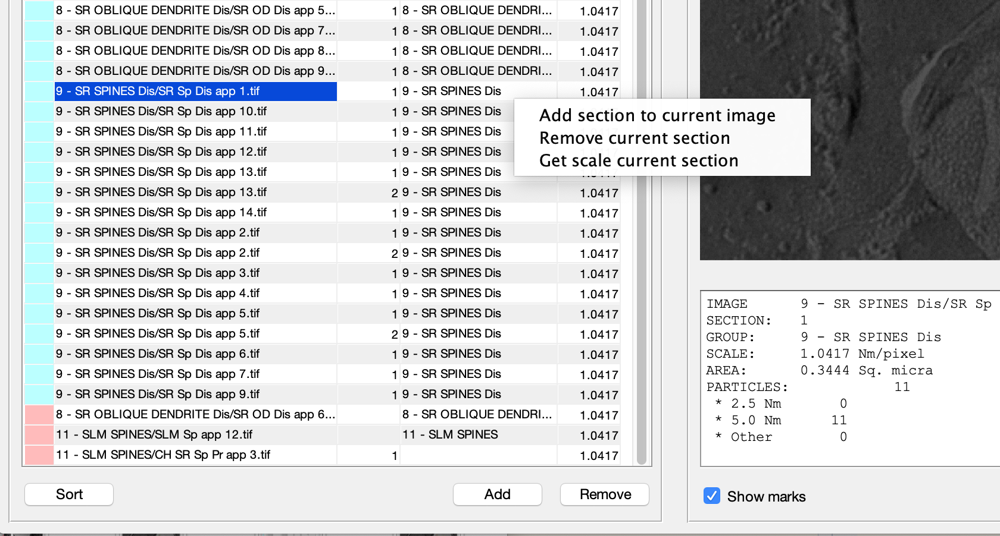
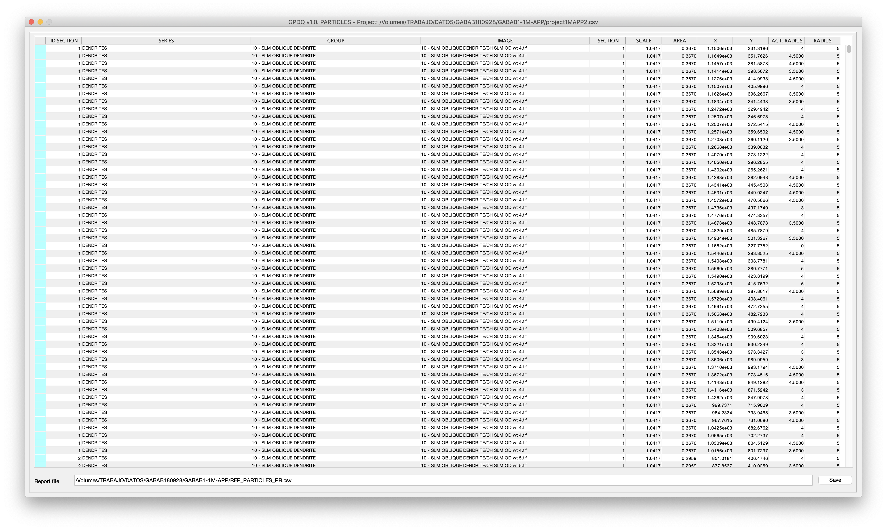

.. _quickstart:

===================
Quickstart: GUI App
===================

The GPDQ APP covers the whole analysis process: from project definition to analysis. It can be executed as an APP (after being installed in Matlab), or from command line as:

.. code-block:: matlab

   setconfig
   gpdq(0.85, project)

where ``0.85`` indicates the size of the window (as proportion of the screen) and ``project`` a file containing a project. Both parameters are optional. Next image shows an screenshoot of the APP. The table in the left panel contains the project definition, whereas the right panel shows the current section. 

.. figure:: ../_images/gpdqGUI.png
    :width: 600px
    :align: center
    :alt: New project edition.
    :figclass: align-center

    Main application.

The analysis of a set of images depends on the study. However, the project preparation and obtention of raw data consists on several common steps.

.. note::
   As starting point, it is necessary to place all images in one folder (that can be organized in subfolders). In this example, the project is created from scratch. However, sections and data files could be previously created with any other program, but must fit the requirements described in section  :ref:`projects`.

|

Step 1: Project creation
==========================

First of all it is necessary to create a project. Menú ``File->New`` launches a window that allows selecting which images (original, no sections) must be included in the project, whether to use or not the subfolders as group names, and to stablish the default scale Nm/pixel (see section :ref:`newproject` for further details). 

.. figure:: ../_images/newProjectEdit.png
    :width: 400px
    :align: center
    :alt: New project edition.
    :figclass: align-center

    Project creation.

By default, the previous function creates a section for each one of the images. It is possible to add, remove, and sort sections. Also, it is possible to add new images (button ``Add``). 

    Functionalities for adding-removing-sorting sections.

Once added the sections, it could be necessary to edit their group names. It can be done directly by editing the table, or with pop-up menu ítem ``Utilities->Rename groups`` (see :ref:`groupedition`), that opens a utility for group renaming.

.. figure:: ../_images/groupEdition.png
    :width: 600px
    :align: center
    :alt: Group edition.
    :figclass: align-center

    Group edition.

Lastly, it is very frequent to work with sets of images with different scales. When scales (Nm/pixel) are not known, it is also possible to calculate the scale of a section.  The pop-up menu option  ``Get scale current section``  opens the utility for scale measurement (see :ref:`measurescale` for details).

.. figure:: ../_images/measureScale.png
    :width: 600px
    :align: center
    :alt: Scale measurement.
    :figclass: align-center

    Scale measuring.

|

Step 2: Section edition
==========================

Original images can be edited in order to obtain the image of the sections (with white background). The  ``Edit`` in the main windows opens the edition utility with the current section. It allows selecting (with a tool) the areas to be included/discarded (see :ref:`editsection`) for details. It creates the corresponding ``_sec_n.tif`` image. 

.. figure:: ../_images/createSection.png
    :width: 600px
    :align: center
    :alt: Section edition.
    :figclass: align-center

    Section edition.

.. note::
   When the image corresponding to a section does not exist, the software considers the whole image as the section. 

|

Step 3: Section labeling
==========================

The button ``Label`` in the main window opens the functionality for labeling with the section curently selected. Labeling can be made either manually or automatically. This functionality saves the information about each section (localization, expected radius and actual radius) in a ``_sec_n.csv`` file. It also allows adding landmarks to mark elements such as intermembrane particles (see ``sectionlabeling`` for a more detailed description). 

.. figure:: ../_images/sectionLabeling.png
    :width: 600px
    :align: center
    :alt: Section labeling.
    :figclass: align-center

    Section labeling.   

Step 4: Create project data object
==================================

Al the information about the project is contained in the ``.tif`` and ``.csv`` files. However, its lecture and process takes time (all files need to be open). Because of that, it is convenient to read and store it in a data objec before analysis. Menu option ``Project data->Update`` opens the functionality that reads all the data files and stores all particle data in an object. The object that can be saved in a ``.mat`` file (``Project data->Save``) and loaded for subsequent usages (``Project data->Load``).

.. figure:: ../_images/dataCreation.png
    :width: 600px
    :align: center
    :alt: Data creation.
    :figclass: align-center

    Data object creation.    

Project data creation allows discarding sections that do not contain a minimum number of particles. It also contains an editable tag for identification. Moreover, groups of section can be distributed in experimental series (each one containing several groups) for analysis. 

Step 5: Analysis and visualization
==================================

Once the data object is available, GPDQ App provides different functionalities for analysis. It is easy to implement and incorporate new ones.

At this time there are two types of functionalities. The most basic one, reports,  visualize a summary of the project, and allow  saving it to a ``.csv`` file that can also be processed with software such as `excel` or `R`. For instance, menu item ``Reports->Particle report`` creates a report with the information of all particles. 

    Particle report. 

Other functionalities currently implemented allow exploring and creating both figures and reports in relation to nearest neighbor distances, densities, or clustering.

.. figure:: ../_images/exploreNND.png
    :width: 600px
    :align: center
    :alt: Report showing.
    :figclass: align-center

    Explore NND from project.    

It is also possible to visualize simulations and clusters  (menú ``Figures->Simulation`` and ``Figures->Clusters``). These functionalities also export the images to Matlab figures so that they can be customized. 

.. figure:: ../_images/figureClusters.png
    :width: 600px
    :align: center
    :alt: Cluster visualization.
    :figclass: align-center

    Visualize clusters. 