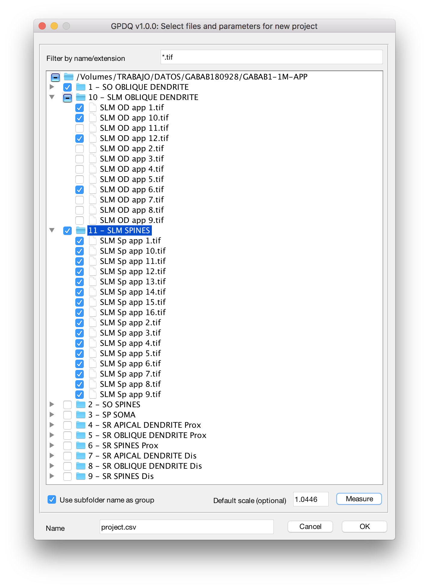
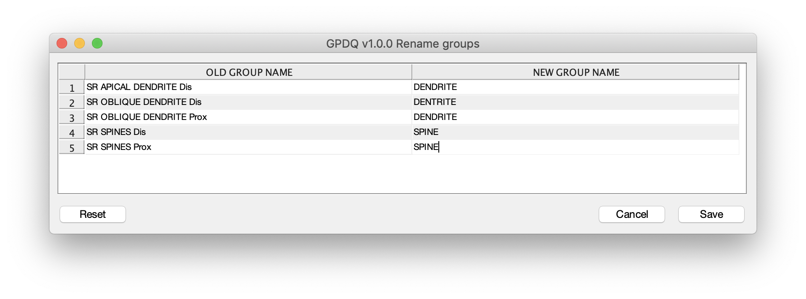
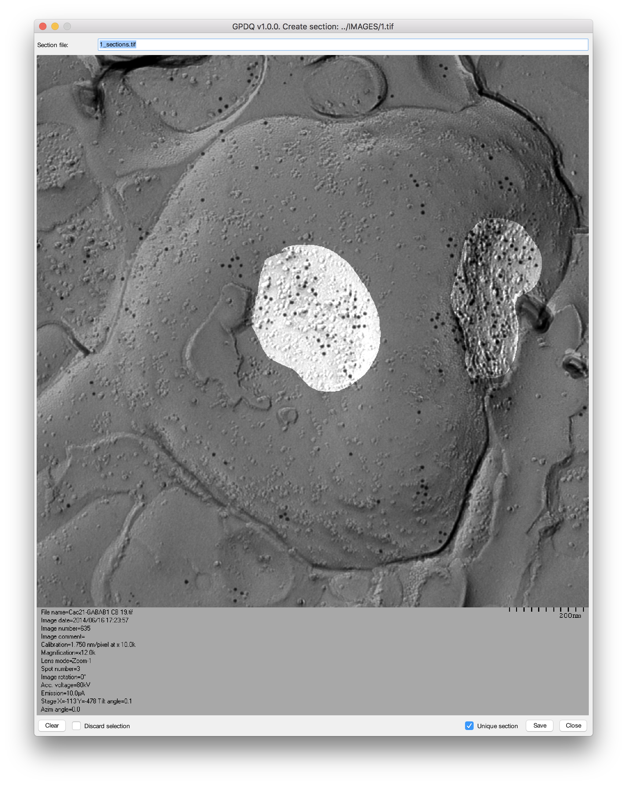
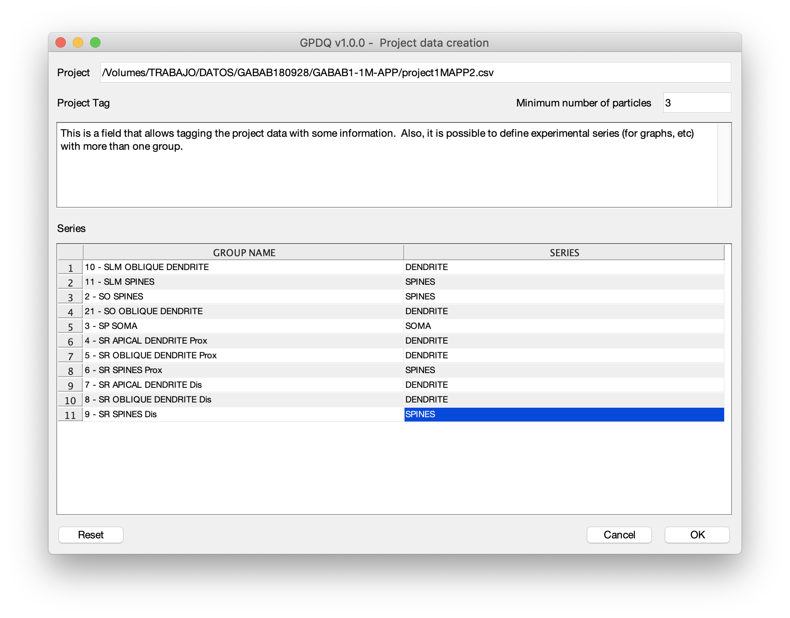
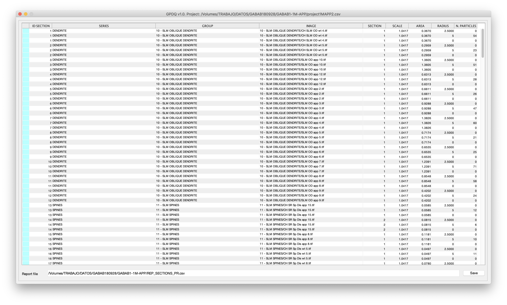
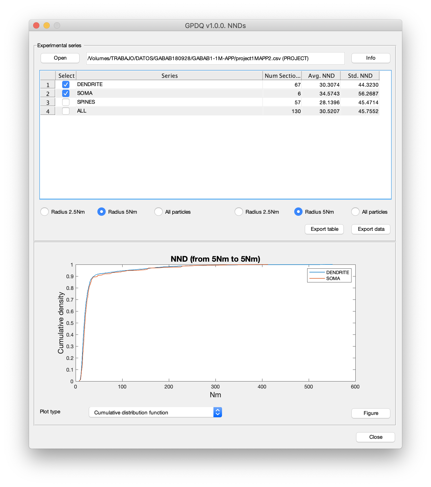

.. _utils:

=================
Utility Functions
=================

How to use each function separately :ref:`newproject` 

.. _newproject:

Creating new projects
=====================

    Project creation with ``newProjectEdit()``.

.. _measurescale:

Measuring scales
=================

.. figure:: ../_images/measureScale.png
    :width: 600px
    :align: center
    :alt: Scale measurement.
    :figclass: align-center

    Scale measuring with ``measureScale()``.

.. _groupedition:

Editing groups
=================

    Group edition with  ``renameGroups()``.

.. _editsection:

Editing sections
================

    Section edition with ``createSection()``.

.. _sectionlabeling:

Section labeling
================

.. figure:: ../_images/sectionLabeling.png
    :width: 600px
    :align: center
    :alt: Section labeling.
    :figclass: align-center

    Section labeling  with ``sectionLabeling()``.    

.. _dataCreation:

Data creation
================

    Data object creation.        

.. _reports:

Showing reports
================

    Report showing with ``showReport()``.  

.. _explore:

Explore data
================

    Explore NND from project. 
